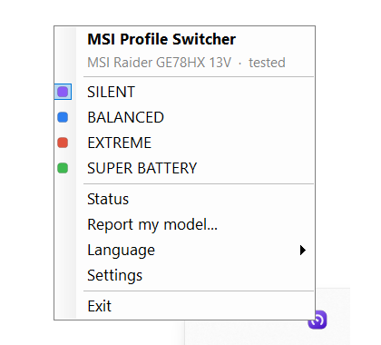
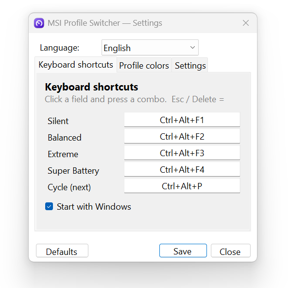
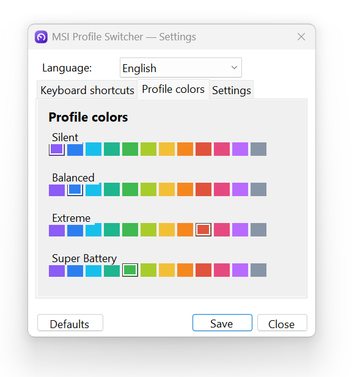
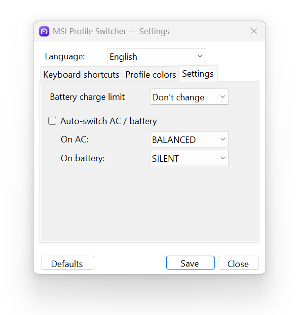
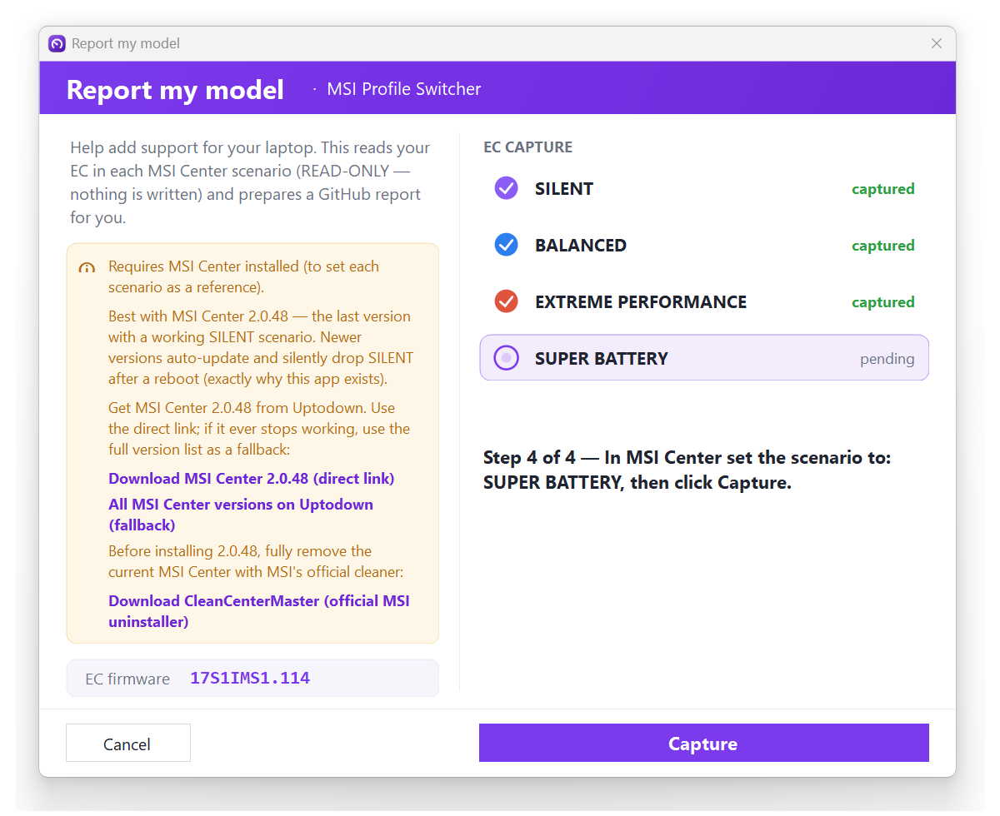

# MSI GE78HX — Restoring the "Silent" profile via the WMI EC interface

> **Language / Język:** **English** · [Polski](TECHNICAL.pl.md)

Full documentation of the problem, the diagnostics, and the solution.
Work date: **2026-06-25**.

---

## 0. TL;DR

- **The problem:** MSI Center 2.0 (a regression from ~February 2025) removed the **Silent** profile. Only these were left: Super Battery (~15 W, too slow), Balanced (~62–75 W, fans scream), Extreme (loud). A quiet-but-usable ~38 W profile was missing.
- **Why ThrottleStop didn't help:** on this laptop the firmware holds a hard lock — the MSR power-limit register is locked by the BIOS, and MMIO is overwritten by Intel DTT. From Windows you cannot cap power with the classic tools.
- **Interim fix:** downgrade to **MSI Center 2.0.48** (still has Silent) + a durable block on auto-update.
- **Final solution (this repo):** set Silent **directly through MSI's official WMI interface** (`root\wmi` → `MSI_ACPI` → `Set_Data`), writing to the EC exactly the bytes MSI Center writes for Silent. Works on **any MSI Center version**, **without a driver**, **without RW-Everything**, **without disabling any security**.
- **Confirmed result:** under load PKG Power drops from **104 W → ~30 W**, fully reversible.

---

## 1. Hardware and system

| | |
|---|---|
| Model | **MSI Raider GE78HX 13VH** |
| Board | MS-17S1 |
| CPU | Intel Core **i9-13950HX** |
| BIOS | **E17S1IMS.114** (2025-10-16) |
| EC firmware | **17S1IMS1.114** |
| OS | Windows 11 Home 26200 |
| Environment | Docker Desktop + WSL2 active (→ hypervisor/VBS on) |

---

## 2. The problem

In **MSI Center 2.0**, MSI changed "User Scenario" and **cut the Silent profile**, replacing the lot with the "MSI AI Engine" etc. On the GE78HX, three extremes remained — all useless for quiet office/dev work:

| MSI profile | Real CPU draw | Problem |
|---|---|---|
| ECO-Silent / **Super Battery** | ~15 W | too slow, unusable for work |
| **Balanced** | ~62–75 W | fans scream |
| **Extreme Performance** | max | very loud; a manual fan curve doesn't help (CPU hits ~95 °C) |

Goal: get back **Silent** ≈ PL ~40 W, quiet, without daily BIOS fiddling.

This is a **known MSI regression** (confirmed on the MSI forum and in reviews), not a defect of this unit.

---

## 3. What we tried and why it did NOT work (firmware diagnostics)

Everything below was confirmed by measurement on the machine:

### 3.1 ThrottleStop — no real control
From `ThrottleStop.ini` and the TPL window:
- `NoSetPL=0xF` — TS had **power-limit setting disabled** (read-only).
- `MSRLock=0x1` — the **MSR power-limit register is BIOS-locked** (MSR PL1/PL2 stuck at 220 W).
- `SpeedShift=0` — EPP control in TS disabled (hence EPP attempts had no effect).
- Even after enabling TPL and writing via MMIO: **MMIO PL1 reverted to ~113–122 W**, because **Intel DTT overwrites it**. The entered 35/45 W was ignored.

**Conclusion:** MSR locked + MMIO owned by DTT → TS physically cannot cap power.

### 3.2 Stopping Intel DTT services — no effect
`ipfsvc` (Intel Innovation Platform Framework) and `dptftcs` stopped (`Stop-Service`) — **power still overwritten**. The policy is enforced in the kernel/EC, not in the user-mode service.

### 3.3 powercfg — frequency ceiling ignored
The "Maximum processor frequency" (PROCFREQMAX) setting **does not work under Intel Speed Shift / HWP** — the CPU manages its own p-states and ignores the OS limit.

### 3.4 EPP via powercfg — no audible effect
Setting EPP (PERFEPP) to ~75 didn't noticeably change behavior (DTT rules anyway).

### 3.5 RW-Everything — blocked by Windows
Trying the EC tool `RW-Everything` failed with "Driver cannot be loaded".
- Cause: `VulnerableDriverBlocklistEnable = 1` (Microsoft Vulnerable Driver Blocklist).
- Log: CodeIntegrity **Event 3077** — `RwDrv.sys ... did not meet ... code integrity policy`.
- `RwDrv.sys` and old `WinRing0` are on the vulnerable-driver list (abused by ransomware, incl. Akira 2025). They **cannot be loaded** without disabling the protection — which we deliberately avoided.

### 3.6 VBS/Hyper-V context (checked, NOT the cause)
`VirtualizationBasedSecurityStatus=2` (on), `HyperVisorPresent=True` — but because of **Docker Desktop + WSL2**, not Memory Integrity (HVCI off). VBS may affect undervolting (FIVR), **not** power limits. We didn't touch virtualization (the dev environment must keep working).

**Stage conclusion:** without unlocking the OC-lock in the hidden BIOS, you cannot cap power "by force" from Windows. So we took the path of the **legitimate MSI interface**.

---

## 4. Interim solution — downgrade to MSI Center 2.0.48

The Silent profile is not BIOS magic — it's **a ready-made policy that older MSI Center exposed as a button**.

1. Uninstall MSI Center 2.0.70.
2. Install **MSI Center 2.0.48.0** (has Silent → ~38 W, 66–74 °C, quiet).
3. Block auto-update (3 layers):
   - **Durable Store policy:** `HKLM\SOFTWARE\Policies\Microsoft\WindowsStore` → `AutoDownload` (DWORD) = `2`.
     (The in-app Store toggle is non-durable — Windows re-enables it. That was the source of "it updates itself".)
   - In MSI Center: uncheck Auto update for "MSI Center Update (SDK)" and "Features"; "Always update" off.
   - Firewall block on MSI servers.
   - Revert auto-update: `AutoDownload = 4`.

> MSI Center is a **Microsoft Store** app (`9426MICRO-STARINTERNATION.MSICenter`) — that's why blocking MSI's servers didn't stop updates. The UAC prompt at MSI Center launch (publisher Micro-Star, local `MSI Center.exe`) is normal elevation, not an update.

**Backup:** keep the 2.0.48 installer = a "restore button" in a minute.

---

## 5. The breakthrough — MSI's official WMI interface to the EC

Instead of fighting drivers, we checked **how MSI Center talks to the firmware**. It turned out to be **WMI** — no third-party driver at all.

### 5.1 Discovering the classes
In `root\wmi` there is a family of **`MSI_*`** classes: `MSI_ACPI`, `MSI_AP`, `MSI_CPU`, `MSI_Power`, `MSI_System`, `MSI_Device`, `MSI_Software`.

### 5.2 MSI_ACPI methods
Instance: `ACPI\PNP0C14\0_0`. Methods include:
```
Get_EC, Set_EC, Get_Data, Set_Data, Get_Range, Set_Range,
Get_Fan, Set_Fan, Get_Power, Set_Power, Get_Thermal, Set_Thermal, ...
```
- **`Get_Data`** (in/out) = **read** an addressed EC byte.
- **`Set_Data`** (in/out) = **write** an addressed EC byte.
- `Get_EC` (out-only) = returns the **EC firmware version string** (e.g. `17S1IMS1.114` + date/time), not registers.

### 5.3 The buffer format — `Package_32`
The `Data` parameter is the embedded class **`Package_32`** = a single property **`Bytes` : UInt8[32]** (a 32-byte buffer).

**Decoded format:**
- **Read (`Get_Data`):** input `Bytes[0] = address`. Output `Bytes[0] = 01` (OK flag), **`Bytes[1] = value`**.
- **Write (`Set_Data`):** `Bytes[0] = address`, `Bytes[1] = value`.
- Requires administrator privileges.

### 5.4 EC register map (source: the msi-ec project, block `CONF_G2_10`, firmware 17S1IMS1.114)
| Function | Address | Values |
|---|---|---|
| **Shift Mode** | `0xD2` | Eco `0xC2`, Comfort `0xC1`, Turbo `0xC4` |
| **Fan Mode** | `0xD4` | Auto `0x0D`, **Silent `0x1D`**, Advanced `0x8D` |
| **Super Battery** | `0xEB` | mask `0x0F` |
| **Cooler Boost** | `0x98` | bit 7 |

> msi-ec is a Linux kernel driver — we use it **only as hardware documentation** (the EC address map is a property of the chip, not the OS). Nothing from Linux is run.

---

## 6. Measurements — what each scenario actually sets

### 6.1 Snapshot of 4 key addresses (after switching in MSI Center)
| Scenario | 0xD2 | 0xD4 | 0xEB | 0x98 |
|---|---|---|---|---|
| **Silent** | C1 | **1D** | 00 | 02 |
| Balanced | C1 | 0D | 00 | 02 |
| Extreme | C4 | 0D | 00 | 02 |
| Super Battery | C2 | 0D | 0F | 02 |

### 6.2 Full 256-byte EC diff (Silent vs the rest, sensor noise filtered out)
Stable (non-sensor) differences **Silent vs Balanced**:
| Address | Silent | Balanced | role |
|---|---|---|---|
| `0x34` | **00** | 01 | power-cap co-flag |
| `0x89` | **30** | 3C | (later: fan-speed sensor — see §8) |
| `0x91` | **50** | 5F | (later: fan-speed sensor — see §8) |
| `0xD4` | **1D** | 0D | fan mode = Silent |

> Purely sensor bytes (change on their own): e.g. `0x46/0x48/0x4A` (voltages/counters), `0x68`, `0x80` (temp), `0xC9/0xCB` (RPM), `0xF4` (temp). Ignored.

### 6.3 Complete scenario "recipes" (corrected — see §8)
| Scenario | 0xD2 | 0x34 | 0xEB | 0xD4 |
|---|---|---|---|---|
| **SILENT** | C1 | 00 | 00 | **1D** |
| **BALANCED** | C1 | 01 | 00 | 0D |
| **EXTREME** | C4 | 01 | 00 | 0D |
| **SUPER BATTERY** | C2 | 01 | 0F | 0D |

---

## 7. Write test — proof the power cap lives in the EC

A reversible test script (auto-revert) wrote the Silent recipe in phases while physically on **Balanced**, under **TS Bench** load, watching PKG Power in ThrottleStop:

| Phase | Written | PKG Power | Clock | Temp | Noise |
|---|---|---|---|---|---|
| 1 | `0xD4=1D` | **32 W** | 2.1 GHz | 65 °C | quiet |
| 2 | +`0x34=00` | 28 W | 2.0 GHz | 65 °C | quiet |
| 3 | +`0x89=30,0x91=50` | 27 W | 2.1 GHz | 65 °C | quiet |
| revert | Balanced values | **104 W** | 3.76 GHz | **95 °C** | loud |

**Conclusions:**
- The power cap is **in the EC** and we control it fully via WMI: 104 W → ~30 W under identical load.
- **The key lever is `0xD4=0x1D`** (fan mode = Silent) — the EC firmware ties it to the power cap. Phase 1 alone did it; the rest only fine-tunes.
- Fully **reversible**; during the test MSI Center **did not overwrite** the writes (it doesn't poll the EC in a loop, only on events).

---

## 8. Correction — `0x89`/`0x91` are sensors, not settings

Analysis of msi-ec (CONF_G2_10) showed that `0x89` and `0x91` are **fan-speed read registers** (CPU fan `0x71`, GPU fan `0x89`), **not** settings. In the dumps they differed only because the fans were spinning differently in each scenario. **They were removed from the recipes.** The power cap comes from `0xD4=1D` (+ `0x34`), so Silent works identically and the write is clean (no more false "not accepted").

Extra EC addresses (for the app's Status window): CPU temp `0x68`, GPU temp `0x80`, CPU fan `0x71` (%), GPU fan `0x89` (%), **charge limit `0xD7` = `0x80 | percent`** (10–100).

---

## 9. Final solution — files and usage

Standalone scripts (in the repo: `scripts/`):

| File | Role |
|---|---|
| `Silent.cmd` | double-click → UAC → sets **Silent** |
| `Balanced.cmd` | double-click → UAC → sets **Balanced** |
| `Silent.ps1` / `Balanced.ps1` | logic (EC write via MSI WMI, self-elevation, readback) |
| `Set-MsiProfile.ps1` | `-Mode Silent\|Balanced\|Extreme\|SuperBattery` (set profile from the command line) |
| `diagnostics/msi_ec_snapshot.ps1` | read 4 addresses in each mode (for re-verification) |
| `diagnostics/msi_ec_fulldump.ps1` | full 256-byte EC dump in each mode (for diffing) |
| `diagnostics/msi_silent_TEST.ps1` | phased test with auto-revert (for re-validation) |

**Usage:** double-click `Silent.cmd` → "Yes" at UAC → a window flashes, shows the written bytes, and closes. Profile set, **independent of the MSI Center version**.

### Technical core (to reproduce manually)
```powershell
$inst = Get-CimInstance -Namespace root\wmi -ClassName MSI_ACPI
function WriteEC([byte]$a,[byte]$v){
  $b = New-Object byte[] 32; $b[0]=$a; $b[1]=$v
  $pkg = New-CimInstance -Namespace root\wmi -ClassName Package_32 -ClientOnly -Property @{Bytes=$b}
  [void](Invoke-CimMethod -InputObject $inst -MethodName Set_Data -Arguments @{Data=$pkg})
}
# SILENT:
WriteEC 0xD2 0xC1; WriteEC 0x34 0x00; WriteEC 0xEB 0x00; WriteEC 0xD4 0x1D
```

---

## 10. Limitations and notes

- **The profile may revert** after clicking a scenario in MSI Center or after sleep/resume. Fix: run Silent again (or use the app, which re-syncs).
- **After a BIOS/EC firmware update** the addresses may change — you must **re-derive the recipe** (procedure below). So: don't update the BIOS without need.
- Requires administrator privileges (hence UAC).
- This is the EC, not flashing — a bad write clears on reboot; the CPU has an independent thermal guard (PROCHOT 95 °C).

---

## 11. Re-derivation procedure after a BIOS update

> **Shortcut:** for adding a *new model* (not re-deriving after a BIOS update), the app's tray
> menu → **Report my model…** automates steps 2–3 below: it captures a full read-only EC dump in
> each MSI Center scenario, diffs them, and opens a pre-filled GitHub issue. The manual flow below
> stays the reference for analysis and for re-derivation after a firmware change.

1. Install MSI Center with a working Silent (or use 2.0.48) — you need a live reference.
2. `pwsh -ExecutionPolicy Bypass -File scripts/diagnostics/msi_ec_fulldump.ps1` → switch scenarios (Silent/Balanced/Extreme/Super Battery).
3. Compare `[SILENT]` vs `[BALANCED]`, filter out sensor noise → new values for `0x34/0xD4` (and possibly new addresses from the current msi-ec).
4. Put the new values into the recipes (`Profiles.cs` in the app, or `Silent.ps1`/`Balanced.ps1`).

---

## 12. Why this solution is safe

- It writes **only the values MSI Center itself sets** for a given scenario — like clicking the button, but over the same channel.
- It uses the **official MSI WMI interface** (ACPI/firmware), not a suspicious driver.
- It **does not disable** the Vulnerable Driver Blocklist or any other security.
- It **does not touch** the BIOS, VBS, Hyper-V, or the Docker/WSL2 environment.
- After each write it **reads back** for verification; it is fully reversible.

---

## 13. Sources

- BeardOverflow/msi-ec — driver and EC register maps: https://github.com/BeardOverflow/msi-ec
- msi-ec.c (config for 17S1IMS1.114, block CONF_G2_10): https://github.com/BeardOverflow/msi-ec/blob/main/msi-ec.c
- Issue #542 — Raider GE78 HX 13V, EC 17S1IMS1.114: https://github.com/BeardOverflow/msi-ec/issues/542
- MSI forum — "MSI Center update has removed silent mode": https://forum-en.msi.com/index.php?threads/msi-center-update-has-removed-silent-mode.409919/
- Microsoft Vulnerable Driver Blocklist: https://learn.microsoft.com/en-us/windows/security/application-security/application-control/app-control-for-business/design/microsoft-recommended-driver-block-rules
- Akira ransomware abuses rwdrv.sys (GuidePoint): https://www.guidepointsecurity.com/newsroom/akira-ransomware-abuses-cpu-tuning-tool-to-disable-microsoft-defender/
- PawnIO (clean alternative ring0 driver, if ever needed): https://poorlydocumented.com/2025/09/replacing-winring0-in-fan-control-with-pawnio/

---

## 14. EC value cheat sheet

```
Addr   Silent  Balanced  Extreme  SuperBattery   Meaning
0xD2    C1       C1        C4        C2            shift mode (Comfort/Turbo/Eco)
0x34    00       01        01        01            power-cap co-flag
0xD4    1D       0D        0D        0D            fan mode (Silent/Auto)  <-- KEY
0x89    —        —         —         —             SENSOR: GPU fan speed (%) - NOT a setting
0x91    —        —         —         —             SENSOR (dynamic) - ignore
0xEB    00       00        00        0F            super battery (mask 0x0F)
0x98    02       02        02        02            (cooler boost bit7 — constant)
```

---

## 15. The native app — `MSIProfileSwitcher.exe` (C# .NET 8)

A full-featured program that supersedes the PS scripts (kept as a backend/reference).

**Download:** the latest `MSIProfileSwitcher.exe` from the repo's **Releases**. Single-file, self-contained (~154 MB), no install, no .NET required. Build: `dotnet publish -c Release -r win-x64 --self-contained -p:PublishSingleFile=true`.

**Features:**
- Tray icon (color = active profile), menu with 4 profiles, left-click = cycle.
- **8 languages** (EN/PL/DE/FR/ES/中文/PT-BR/RU) — "Language" menu + dropdown in Settings.
- **Per-profile color** — 12 swatches (Settings → Colors); affects the OSD and the icon.
- **Global hotkeys**, rebindable (default Ctrl+Alt+F1–F4 + Ctrl+Alt+P).
- **OSD** "MSI · PROFILE" (profile color, no focus stealing, fade-out).
- **Status window** — live: CPU/GPU temp (`0x68`/`0x80`), fan % (`0x71`/`0x89`), charge limit (`0xD7`), EC firmware, switch count, time in profile, autostart, version.
- **Autostart** = scheduled task (ONLOGON, RL HIGHEST) created/removed from Settings.
- **AC/battery auto-switch** — OFF by default (so it won't collide with MSI), with a profile choice for AC and battery.
- **External sync** — polls the EC every 3 s; if MSI Center/anything changes the profile, the tray/OSD/menu re-sync automatically.
- **Battery charge limit** — Don't change / 100% / 80% / 60% (`0xD7 = 0x80 | %`).
- `requireAdministrator` manifest (EC write); settings in `%AppData%\MSIProfileSwitcher\settings.json`.

**EC in C#:** `System.Management` → `ManagementClass("root\\wmi","Package_32")` + `MSI_ACPI.Get_Data/Set_Data` (the same channel as the scripts).

**Screenshots:**

| Tray menu | Status / Diagnostics |
|:---:|:---:|
|  |  |
| Keyboard shortcuts | Profile colors |
|  |  |
| Power | Report my model |
|  |  |

## 16. Hidden test / discovery tools (Ctrl+Shift+T)

The main window has a hidden developer dialog for probing the EC on new hardware. It is intentionally not shown in the UI; open it with **Ctrl+Shift+T** while the main window is focused (`TestDialog.cs`, wired in `MainForm`).

It provides, all gated on the normal write-safety rules (Tested / opted-in Experimental):

- **RPM finder** — two read-only EC scans at different fan speeds. The fan tachometer is the address whose value changes between scans; `RPM = 478000 / value`. Verified on the Raider GE78HX 13V (`17S1IMS1`): **`0xC9` = CPU fan (Fan 1)**, **`0xCB` = GPU fan (Fan 2)**, within ~1% of MSI Center.
- **Live RPM** — continuous read of `0xC9` / `0xCB` for comparing against MSI Center.
- **Save EC dump to file** — read-only 256-byte dump, used to locate fan-curve table addresses.
- **Silent + Advanced experiment** — writes `0xD4=0x8D` on top of the Silent recipe to check whether the EC honours Advanced fan control outside Extreme (it does on the GE78HX), plus a one-click revert.

Fan-curve tables discovered on `17S1IMS1` (6 points each): CPU temps `0x6A–0x6F`, CPU speeds `0x73–0x78`; GPU temps `0x82–0x87`, GPU speeds `0x8B–0x90`. Advanced fan mode = `0xD4=0x8D`.
