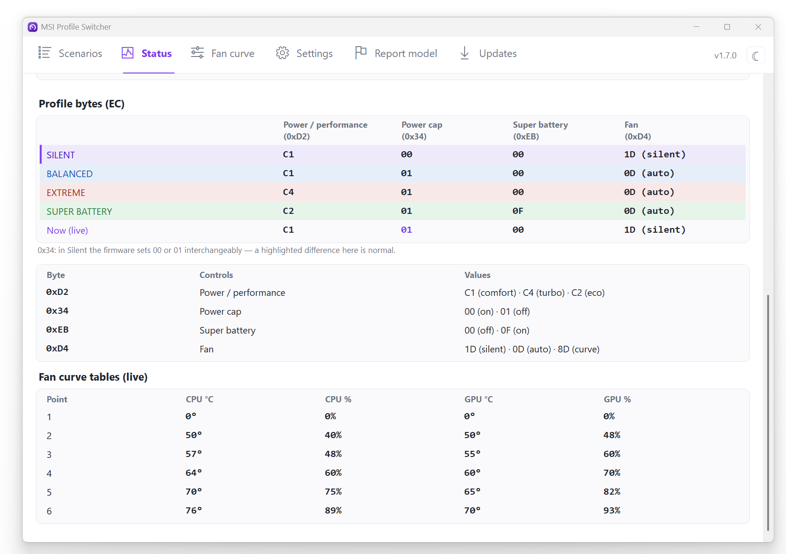
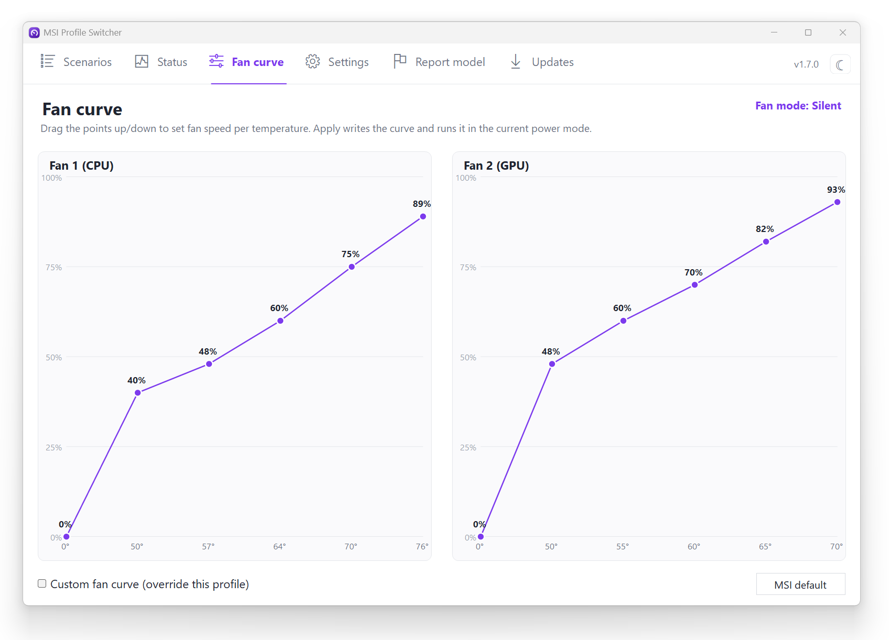

# MSI GE78HX — przywrócenie profilu „Silent" przez interfejs WMI EC

> **Język / Language:** **Polski** · [English](TECHNICAL.md)

Pełna dokumentacja problemu, diagnostyki i rozwiązania.
Data prac: **2026-06-25**.

---

## 0. TL;DR (streszczenie dla niecierpliwych)

- **Problem:** MSI Center 2.0 (regresja z ~lutego 2025) usunął profil **Silent**. Zostały tylko: Super Battery (~15 W, za wolno), Balanced (~62–75 W, wentylatory wyją), Extreme (głośno). Brakowało cichego, ale wydajnego profilu (~38 W).
- **Dlaczego ThrottleStop nie pomógł:** na tym laptopie firmware trzyma twardą blokadę — rejestr MSR limitów mocy zablokowany przez BIOS, MMIO nadpisywane przez Intel DTT. Z poziomu Windows nie da się capnąć mocy klasycznymi narzędziami.
- **Rozwiązanie tymczasowe:** downgrade do **MSI Center 2.0.48** (ma jeszcze Silent) + twarda blokada auto-update.
- **Rozwiązanie docelowe (to repo):** ustawianie Silent **bezpośrednio przez oficjalny interfejs MSI WMI** (`root\wmi` → `MSI_ACPI` → `Set_Data`), zapisując do EC dokładnie te bajty, które MSI Center ustawia dla Silent. Działa **na dowolnej wersji MSI Center**, **bez sterownika**, **bez RW-Everything**, **bez wyłączania zabezpieczeń**.
- **Efekt potwierdzony:** pod obciążeniem PKG Power spada ze **104 W → ~30 W**, w pełni odwracalnie.

---

## 1. Sprzęt i system

| | |
|---|---|
| Model | **MSI Raider GE78HX 13VH** |
| Płyta | MS-17S1 |
| CPU | Intel Core **i9-13950HX** |
| BIOS | **E17S1IMS.114** (2025-10-16) |
| Firmware EC | **17S1IMS1.114** |
| System | Windows 11 Home 26200 |
| Środowisko | aktywne Docker Desktop + WSL2 (→ hypervisor/VBS włączone) |

---

## 2. Problem

MSI w wersji **MSI Center 2.0** zmieniło „User Scenario" i **wycięło profil Silent**, zastępując całość m.in. „MSI AI Engine". Na GE78HX zostały trzy nieużyteczne dla cichej pracy biurowej/programistycznej skrajności:

| Profil MSI | Realny pobór CPU | Problem |
|---|---|---|
| ECO-Silent / **Super Battery** | ~15 W | za wolno, nie da się pracować |
| **Balanced** | ~62–75 W | wentylatory wyją |
| **Extreme Performance** | maks | bardzo głośno; ręczna krzywa wentylatora nie pomaga (CPU grzeje się do ~95 °C) |

Cel: odzyskać **Silent** ≈ PL ~40 W, cicho, bez codziennego grzebania w BIOS-ie.

To **znana regresja MSI** (potwierdzona na forum MSI i w recenzjach), nie wada egzemplarza.

---

## 3. Co próbowaliśmy i dlaczego NIE działało (diagnostyka firmware)

Wszystkie poniższe potwierdzone pomiarowo na maszynie:

### 3.1 ThrottleStop — brak realnej kontroli
Z `ThrottleStop.ini` i okna TPL:
- `NoSetPL=0xF` — TS miał **wyłączone ustawianie limitów** (tylko czytał).
- `MSRLock=0x1` — **rejestr MSR limitów mocy zablokowany przez BIOS** (MSR PL1/PL2 utknęły na 220 W).
- `SpeedShift=0` — kontrola EPP w TS wyłączona (stąd próby z EPP bez efektu).
- Nawet po włączeniu TPL i zapisie przez MMIO: **MMIO PL1 wracało do ~113–122 W**, bo **Intel DTT nadpisuje**. Wpisane 35/45 W ignorowane.

**Wniosek:** MSR locked + MMIO przejęte przez DTT → TS fizycznie nie ma jak capnąć mocy.

### 3.2 Wyłączenie usług Intel DTT — bez efektu
`ipfsvc` (Intel Innovation Platform Framework) i `dptftcs` zatrzymane (`Stop-Service`) — **moc dalej nadpisywana**. Polityka jest egzekwowana w jądrze/EC, nie w usłudze user-mode.

### 3.3 powercfg — sufit częstotliwości ignorowany
Ustawienie „Maximum processor frequency" (PROCFREQMAX) **nie działa pod Intel Speed Shift / HWP** — CPU sam zarządza p-state'ami i olewa limit OS.

### 3.4 EPP przez powercfg — brak słyszalnego efektu
Ustawienie EPP (PERFEPP) na ~75 nie zmieniło zauważalnie zachowania (DTT i tak rządzi).

### 3.5 RW-Everything — zablokowany przez Windows
Próba użycia narzędzia EC `RW-Everything` skończyła się błędem „Driver cannot be loaded".
- Przyczyna: `VulnerableDriverBlocklistEnable = 1` (Microsoft Vulnerable Driver Blocklist).
- Log: CodeIntegrity **Event 3077** — `RwDrv.sys ... did not meet ... code integrity policy`.
- `RwDrv.sys` i stary `WinRing0` są na liście podatnych sterowników (nadużywane przez ransomware, m.in. Akira 2025). **Nie da się ich załadować** bez wyłączenia zabezpieczenia — czego świadomie unikaliśmy.

### 3.6 Kontekst VBS/Hyper-V (sprawdzone, NIE jest przyczyną)
`VirtualizationBasedSecurityStatus=2` (włączone), `HyperVisorPresent=True` — ale z powodu **Docker Desktop + WSL2**, nie Memory Integrity (HVCI off). VBS dotyka ewentualnie undervoltingu (FIVR), **nie** limitów mocy. Nie ruszaliśmy wirtualizacji (środowisko dev musi działać).

**Konkluzja etapu:** bez odblokowania OC-lock w ukrytym BIOS-ie nie da się capnąć mocy „siłowo" z Windows. Dlatego poszliśmy ścieżką **legalnego interfejsu MSI**.

---

## 4. Rozwiązanie tymczasowe — downgrade MSI Center 2.0.48

Profil Silent to nie magia BIOS-u, tylko **gotowa polityka, którą starsze MSI Center wystawiało jako przycisk**.

1. Odinstalować MSI Center 2.0.70.
2. Zainstalować **MSI Center 2.0.48.0** (ma Silent → ~38 W, 66–74 °C, ciche).
3. Zablokować auto-update (3 warstwy):
   - **Trwała polityka Sklepu:** `HKLM\SOFTWARE\Policies\Microsoft\WindowsStore` → `AutoDownload` (DWORD) = `2`.
     (Sam suwak w Sklepie jest nietrwały — Windows go z powrotem włącza. To było źródłem „samo się aktualizuje".)
   - W MSI Center: odznaczyć Auto update dla „MSI Center Update (SDK)" i „Features"; „Always update" off.
   - Firewall na serwery MSI.
   - Powrót auto-update: `AutoDownload = 4`.

> MSI Center to aplikacja **Microsoft Store** (`9426MICRO-STARINTERNATION.MSICenter`) — dlatego blokada serwerów MSI nie zatrzymywała aktualizacji. UAC przy starcie MSI Center (wydawca Micro-Star, lokalny `MSI Center.exe`) to normalna elewacja, nie update.

**Backup:** zachować instalator 2.0.48 = „przycisk odtwórz" w minutę.

---

## 5. Przełom — oficjalny interfejs MSI WMI do EC

Zamiast walczyć ze sterownikami, sprawdziliśmy, **czym MSI Center gada z firmware**. Okazało się, że jest do tego **WMI** — bez żadnego sterownika trzeciej strony.

### 5.1 Odkrycie klas
W `root\wmi` istnieje rodzina klas **`MSI_*`**: `MSI_ACPI`, `MSI_AP`, `MSI_CPU`, `MSI_Power`, `MSI_System`, `MSI_Device`, `MSI_Software`.

### 5.2 Metody MSI_ACPI
Instancja: `ACPI\PNP0C14\0_0`. Metody m.in.:
```
Get_EC, Set_EC, Get_Data, Set_Data, Get_Range, Set_Range,
Get_Fan, Set_Fan, Get_Power, Set_Power, Get_Thermal, Set_Thermal, ...
```
- **`Get_Data`** (in/out) = **odczyt** adresowanego bajtu EC.
- **`Set_Data`** (in/out) = **zapis** adresowanego bajtu EC.
- `Get_EC` (out-only) = zwraca **string wersji firmware EC** (np. `17S1IMS1.114` + data/godzina), nie rejestry.

### 5.3 Format bufora — `Package_32`
Parametr `Data` to zagnieżdżona klasa **`Package_32`** = jedna właściwość **`Bytes` : UInt8[32]** (32-bajtowy bufor).

**Rozszyfrowany format:**
- **Odczyt (`Get_Data`):** wejście `Bytes[0] = adres`. Wyjście `Bytes[0] = 01` (flaga OK), **`Bytes[1] = wartość`**.
- **Zapis (`Set_Data`):** `Bytes[0] = adres`, `Bytes[1] = wartość`.
- Wymaga uprawnień administratora.

### 5.4 Mapa rejestrów EC (źródło: projekt msi-ec, blok `CONF_G2_10`, firmware 17S1IMS1.114)
| Funkcja | Adres | Wartości |
|---|---|---|
| **Shift Mode** | `0xD2` | Eco `0xC2`, Comfort `0xC1`, Turbo `0xC4` |
| **Fan Mode** | `0xD4` | Auto `0x0D`, **Silent `0x1D`**, Advanced `0x8D` |
| **Super Battery** | `0xEB` | maska `0x0F` |
| **Cooler Boost** | `0x98` | bit 7 |

> msi-ec to sterownik wbudowany w jądro Linuksa — używamy go **tylko jako dokumentacji sprzętu** (mapa adresów EC jest własnością układu, nie systemu). Nic z Linuksa nie uruchamiamy.

---

## 6. Pomiary — co dokładnie ustawia każdy scenariusz

### 6.1 Snapshot 4 kluczowych adresów (po przełączeniu w MSI Center)
| Scenariusz | 0xD2 | 0xD4 | 0xEB | 0x98 |
|---|---|---|---|---|
| **Silent** | C1 | **1D** | 00 | 02 |
| Balanced | C1 | 0D | 00 | 02 |
| Extreme | C4 | 0D | 00 | 02 |
| Super Battery | C2 | 0D | 0F | 02 |

### 6.2 Pełny diff 256 bajtów EC (Silent vs reszta, po odsianiu szumu czujników)
Stabilne (niesensorowe) różnice **Silent vs Balanced**:
| Adres | Silent | Balanced | rola |
|---|---|---|---|
| `0x34` | **00** | 01 | współ-flaga capu mocy |
| `0x89` | **30** | 3C | punkt krzywej wentylatora |
| `0x91` | **50** | 5F | wartość wentylatora |
| `0xD4` | **1D** | 0D | fan mode = Silent |

> Bajty czysto sensoryczne (zmienne same z siebie): m.in. `0x46/0x48/0x4A` (napięcia/liczniki), `0x68`, `0x80` (temp), `0xC9/0xCB` (RPM), `0xF4` (temp). Pominięte.

### 6.3 Kompletne „przepisy" na scenariusze (po korekcie — patrz sekcja 8)
| Scenariusz | 0xD2 | 0x34 | 0xEB | 0xD4 |
|---|---|---|---|---|
| **SILENT** | C1 | 00 | 00 | **1D** |
| **BALANCED** | C1 | 01 | 00 | 0D |
| **EXTREME** | C4 | 01 | 00 | 0D |
| **SUPER BATTERY** | C2 | 01 | 0F | 0D |

---

## 7. Test zapisu — dowód, że cap mocy siedzi w EC

Skrypt testowy (odwracalny, auto-revert) zapisywał przepis Silent fazami, będąc fizycznie na **Balanced**, pod obciążeniem **TS Bench**, z podglądem PKG Power w ThrottleStop:

| Faza | Zapisano | PKG Power | Takt | Temp | Hałas |
|---|---|---|---|---|---|
| 1 | `0xD4=1D` | **32 W** | 2.1 GHz | 65 °C | cicho |
| 2 | +`0x34=00` | 28 W | 2.0 GHz | 65 °C | cicho |
| 3 | +`0x89=30,0x91=50` | 27 W | 2.1 GHz | 65 °C | cicho |
| revert | wartości Balanced | **104 W** | 3.76 GHz | **95 °C** | głośno |

**Wnioski:**
- Cap mocy jest **w EC** i sterujemy nim w pełni przez WMI: 104 W → ~30 W pod tym samym obciążeniem.
- **Kluczowy lewar to `0xD4=0x1D`** (fan mode = Silent) — firmware EC wiąże go z capem mocy. Już sama Faza 1 dała efekt; `0x34/0x89/0x91` tylko dostrajają.
- W pełni **odwracalne**; MSI Center w trakcie testu **nie nadpisywał** zapisów (nie pilnuje EC w pętli, tylko przy zdarzeniach).

---

## 8. Korekta — `0x89`/`0x91` to czujniki, nie ustawienia

Analiza msi-ec (CONF_G2_10) wykazała, że `0x89` i `0x91` to **rejestry odczytu prędkości wentylatorów** (CPU fan `0x71`, GPU fan `0x89`), a **nie** ustawienia. W zrzutach różniły się tylko dlatego, że wentylatory kręciły się inaczej w każdym scenariuszu. **Usunięto je z przepisów.** Cap mocy daje `0xD4=1D` (+ `0x34`), więc Silent działa identycznie, a zapis jest czysty (koniec fałszywych „nie przyjęto").

Dodatkowe adresy EC (do okna Status w aplikacji): temp CPU `0x68`, temp GPU `0x80`, wentylator CPU `0x71` (%), wentylator GPU `0x89` (%), **limit ładowania `0xD7` = `0x80 | procent`** (10–100).

---

## 9. Finalne rozwiązanie — pliki i użycie

Skrypty standalone (w repo: **`scripts/`**):

| Plik | Rola |
|---|---|
| `Silent.cmd` | dwuklik → UAC → ustawia **Silent** |
| `Balanced.cmd` | dwuklik → UAC → ustawia **Balanced** |
| `Silent.ps1` / `Balanced.ps1` | logika (zapis EC przez MSI WMI, self-elevacja, readback) |
| `Set-MsiProfile.ps1` | `-Mode Silent\|Balanced\|Extreme\|SuperBattery` (z linii poleceń) |
| `diagnostics/msi_ec_snapshot.ps1` | pomiar 4 adresów w każdym trybie (do re-weryfikacji) |
| `diagnostics/msi_ec_fulldump.ps1` | pełny zrzut 256 B EC w każdym trybie (do diffa) |
| `diagnostics/msi_silent_TEST.ps1` | test fazowy z auto-revertem (do ponownej walidacji) |

**Użycie:** dwuklik `Silent.cmd` → „Tak" w UAC → okno mignie, pokaże zapisane bajty i się zamknie. Profil ustawiony, **niezależnie od wersji MSI Center**.

Wygoda: prawy klik `Silent.cmd` → Wyślij do → Pulpit (skrót). Folder można przenieść gdziekolwiek — **trzymać 4 pliki razem** (`.cmd` używa ścieżki względnej).

### Rdzeń techniczny (gdyby trzeba odtworzyć ręcznie)
```powershell
$inst = Get-CimInstance -Namespace root\wmi -ClassName MSI_ACPI
function WriteEC([byte]$a,[byte]$v){
  $b = New-Object byte[] 32; $b[0]=$a; $b[1]=$v
  $pkg = New-CimInstance -Namespace root\wmi -ClassName Package_32 -ClientOnly -Property @{Bytes=$b}
  [void](Invoke-CimMethod -InputObject $inst -MethodName Set_Data -Arguments @{Data=$pkg})
}
# SILENT:
WriteEC 0xD2 0xC1; WriteEC 0x34 0x00; WriteEC 0xEB 0x00; WriteEC 0xD4 0x1D
```

---

## 10. Ograniczenia i uwagi

- **Profil może wrócić do innego** po kliknięciu scenariusza w MSI Center albo po uśpieniu/wybudzeniu. Rozwiązanie: ponowny dwuklik `Silent.cmd`. (Można później podpiąć pod hotkey / harmonogram.)
- **Po aktualizacji BIOS/EC firmware** adresy mogą się zmienić — trzeba **przepatrzeć przepis** (procedura niżej). Dlatego: nie aktualizować BIOS bez potrzeby.
- Wymaga uprawnień administratora (stąd UAC).
- To EC, nie flashowanie — zły zapis kasuje się po restarcie; CPU ma niezależny zabezpieczacz termiczny (PROCHOT 95 °C).

---

## 11. Procedura odtworzenia po aktualizacji BIOS

> **Skrót:** aby dodać *nowy model* (a nie odtwarzać przepis po aktualizacji BIOS), użyj w aplikacji
> menu w trayu → **Zgłoś mój model…** (jest też przycisk w oknie Statusu). Kreator automatyzuje kroki 2–3
> poniżej: przechwytuje pełny zrzut EC (tylko odczyt) w każdym scenariuszu MSI Center, porównuje je
> i otwiera wstępnie wypełnione zgłoszenie na GitHub — wystarczy wkleić i wysłać. Ręczna procedura
> poniżej pozostaje wzorcem do analizy i do odtworzenia przepisu po zmianie firmware.

1. Zainstaluj MSI Center z działającym Silent (lub użyj 2.0.48) — potrzebny żywy wzorzec.
2. `pwsh -ExecutionPolicy Bypass -File scripts/diagnostics/msi_ec_fulldump.ps1` → przełączaj scenariusze (Silent/Balanced/Extreme/Super Battery).
3. Porównaj `[SILENT]` vs `[BALANCED]`, odsiej szum czujników → nowe wartości `0x34/0x89/0x91/0xD4` (i ewentualnie nowe adresy z aktualnego msi-ec).
4. Wstaw nowe wartości do `Silent.ps1` / `Balanced.ps1`.

---

## 12. Dlaczego to rozwiązanie jest bezpieczne

- Zapisuje **wyłącznie wartości, które MSI Center sam ustawia** dla danego scenariusza — to jak kliknięcie przycisku, tylko tym samym kanałem.
- Używa **oficjalnego interfejsu MSI WMI** (ACPI/firmware), a nie podejrzanego sterownika.
- **Nie wyłącza** Vulnerable Driver Blocklist ani innych zabezpieczeń.
- **Nie rusza** BIOS-u, VBS, Hyper-V ani środowiska Docker/WSL2.
- Po każdym zapisie **czyta z powrotem** dla weryfikacji; jest w pełni odwracalne.

---

## 13. Źródła

- BeardOverflow/msi-ec — sterownik i mapy rejestrów EC: https://github.com/BeardOverflow/msi-ec
- msi-ec.c (konfiguracja 17S1IMS1.114, blok CONF_G2_10): https://github.com/BeardOverflow/msi-ec/blob/main/msi-ec.c
- Issue #542 — Raider GE78 HX 13V, EC 17S1IMS1.114: https://github.com/BeardOverflow/msi-ec/issues/542
- Forum MSI — „MSI Center update has removed silent mode": https://forum-en.msi.com/index.php?threads/msi-center-update-has-removed-silent-mode.409919/
- Microsoft Vulnerable Driver Blocklist: https://learn.microsoft.com/en-us/windows/security/application-security/application-control/app-control-for-business/design/microsoft-recommended-driver-block-rules
- Akira ransomware nadużywa rwdrv.sys (GuidePoint): https://www.guidepointsecurity.com/newsroom/akira-ransomware-abuses-cpu-tuning-tool-to-disable-microsoft-defender/
- PawnIO (czysty alternatywny sterownik ring0, gdyby kiedyś potrzebny): https://poorlydocumented.com/2025/09/replacing-winring0-in-fan-control-with-pawnio/

---

## 14. Słowniczek wartości EC (szybka ściąga)

```
Adres  Silent  Balanced  Extreme  SuperBattery   Znaczenie
0xD2    C1       C1        C4        C2            shift mode (Comfort/Turbo/Eco)
0x34    00       01        01        01            współ-flaga capu mocy
0xD4    1D       0D        0D        0D            fan mode (Silent/Auto)  <-- KLUCZ
0x89    —        —         —         —             CZUJNIK: obroty wentylatora GPU (%) - NIE ustawienie
0x91    —        —         —         —             CZUJNIK (dynamiczne) - pomijać
0xEB    00       00        00        0F            super battery (maska 0x0F)
0x98    02       02        02        02            (cooler boost bit7 — stałe)
```

---

## 15. Programik z hotkeyami i OSD (MSI-Hotkeys)

Działający w tle przełącznik profili z globalnymi skrótami i nakładką na ekranie (jak „mouse remap: on/off"). Czysty PowerShell + WinForms — **bez AutoHotkey, bez instalacji**.

**Pliki:**
| Plik | Rola |
|---|---|
| `MSI-Hotkeys.ps1` | aplikacja w tle: skróty + OSD + ikona w zasobniku |
| `MSI-Hotkeys.cmd` | uruchamia ją teraz (ukryte okno, UAC raz) |
| `Install-Autostart.cmd` / `.ps1` | autostart przy logowaniu (zadanie Harmonogramu, bez UAC) |
| `Set-MsiProfile.ps1` | `-Mode Silent\|Balanced\|Extreme\|SuperBattery` (zapis profilu z linii poleceń) |

**Skróty (zmienne w sekcji `$Hotkeys` w `.ps1`):**
```
Ctrl+Alt+F1 = Silent          Ctrl+Alt+F3 = Extreme
Ctrl+Alt+F2 = Balanced        Ctrl+Alt+F4 = Super Battery
Ctrl+Alt+P  = cykl wszystkich trybów
```
Lewy klik ikony w zasobniku = cykl; prawy klik = menu wyboru + „Zamknij".

**OSD:** na ~1,7 s pokazuje pasek „MSI · <TRYB>" z kolorem profilu, na górze ekranu, **bez kradzieży fokusa** (nie minimalizuje gier/pracy).

**Uruchomienie teraz:** dwuklik `MSI-Hotkeys.cmd` (UAC → Tak).
**Autostart:** dwuklik `Install-Autostart.cmd` → robi zadanie „MSI Profile Hotkeys" (logowanie, najwyższe uprawnienia, ukryte) i startuje od razu.
**Usunięcie autostartu:** `Unregister-ScheduledTask -TaskName 'MSI Profile Hotkeys' -Confirm:$false`

**Jak działa:** aplikacja jest podniesiona (admin, raz przy starcie), więc zapis EC idzie **w procesie** (bez odpalania osobnego PowerShella na każdy skrót — szybkie). Skróty wykrywane przez `GetAsyncKeyState` (poll 60 ms). Zapis tymi samymi przepisami co w sekcji 6.3.

---

## 16. Aplikacja natywna — `MSIProfileSwitcher.exe` (C# .NET 8)

Pełnoprawny program zastępujący skrypty PS (te zostają jako zaplecze/dokumentacja).

**Pobranie:** najnowszy `MSIProfileSwitcher.exe` z zakładki **[Releases](../../releases)** repo. Pojedynczy plik, self-contained (~154 MB), bez instalacji i bez .NET. Build ze źródeł: `dotnet publish -c Release -r win-x64 --self-contained -p:PublishSingleFile=true`.

**Funkcje:**
- Ikona w zasobniku (kolor = aktywny profil), menu z 4 profilami, lewy klik = cykl.
- **8 języków** (EN/PL/DE/FR/ES/中文/PT-BR/RU) — menu „Język" + dropdown w Ustawieniach.
- **Kolor per profil** — 12 próbek (Ustawienia → Wygląd); wpływa na OSD i ikonę.
- **Globalne skróty** rebindowalne (domyślnie Ctrl+Alt+F1–F4 + Ctrl+Alt+P).
- **OSD** „MSI · PROFIL" (kolor profilu, bez kradzieży fokusa, zanikanie).
- **Okno Status** — na żywo: temp CPU/GPU (`0x68`/`0x80`), wentylatory % (`0x71`/`0x89`), limit ładowania (`0xD7`), firmware EC, liczba przełączeń, czas w profilu, autostart, wersja.
- **Autostart** = zadanie Harmonogramu (ONLOGON, RL HIGHEST) tworzone/usuwane z Ustawień.
- **Auto-przełączanie zasilacz/bateria** — domyślnie WYŁĄCZONE (by nie kolidować z MSI), z wyborem profilu dla AC i baterii.
- **Sync zewnętrzny** — poll EC co 3 s; jeśli profil zmieni MSI Center/cokolwiek, tray/OSD/menu same się dostroją.
- **Limit ładowania baterii** — Nie zmieniaj / 100% / 80% / 60% (`0xD7 = 0x80 | %`).
- Manifest `requireAdministrator` (zapis EC); ustawienia w `%AppData%\MSIProfileSwitcher\settings.json`.

**EC w C#:** `System.Management` → `ManagementClass("root\\wmi","Package_32")` + `MSI_ACPI.Get_Data/Set_Data` (ten sam kanał co skrypty).

**Zrzuty ekranu:**

| Menu w trayu | Scenariusze |
|:---:|:---:|
|  |  |
| Status | Ustawienia |
|  |  |
| Zgłoś mój model | Aktualizacje |
|  |  |

## 17. Ukryte narzędzia testowe / diagnostyczne (Ctrl+Shift+T)

Główne okno ma ukryte okno deweloperskie do badania EC na nowym sprzęcie. Celowo nie jest pokazane w interfejsie; otwiera się je skrótem **Ctrl+Shift+T**, gdy główne okno ma fokus (`TestDialog.cs`, podpięte w `MainForm`).

Zawiera (wszystko pod zwykłą bramką bezpieczeństwa zapisu — Tested / włączone Experimental):

- **Wyszukiwarka RPM** — dwa odczyty EC (tylko odczyt) przy różnych obrotach. Tachometr to adres, którego wartość zmienia się między skanami; `RPM = 478000 / wartość`. Zweryfikowane na Raider GE78HX 13V (`17S1IMS1`): **`0xC9` = wentylator CPU (Fan 1)**, **`0xCB` = wentylator GPU (Fan 2)**, w granicach ~1% względem MSI Center.
- **RPM na żywo** — ciągły odczyt `0xC9` / `0xCB` do porównania z MSI Center.
- **Zapisz zrzut EC do pliku** — zrzut 256 bajtów (tylko odczyt) do namierzania adresów tablic krzywej wentylatora.
- **Eksperyment Silent + Advanced** — wpisuje `0xD4=0x8D` na recepturze Silent, żeby sprawdzić, czy EC słucha trybu Advanced poza Extreme (na GE78HX słucha), plus powrót jednym kliknięciem.

Tablice krzywej wentylatora znalezione na `17S1IMS1` (po 6 punktów): temperatury CPU `0x6A–0x6F`, prędkości CPU `0x73–0x78`; temperatury GPU `0x82–0x87`, prędkości GPU `0x8B–0x90`. Tryb Advanced = `0xD4=0x8D`.

## 18. Bajty profili, tryby wentylatora i nakładka krzywej

Ta sekcja dokumentuje, które bajty EC definiują profil, jak mają się do nich bajty wentylatora oraz jaki problem napotkaliśmy przy dodawaniu własnej krzywej (i jak go rozwiązaliśmy).

Aplikacja pokazuje to wszystko na żywo: zakładka Status ma macierz bajtów profilu, legendę i tablice krzywej, a zakładka Krzywa wentylatora pozwala krzywą edytować.

| | |
|:---:|:---:|
|  |  |
| Status — macierz bajtów profilu, legenda i tablice krzywej (na żywo) | Krzywa wentylatora — edytowalna krzywa CPU/GPU nakładana na bieżący profil |

### 18.1 Bajty tworzące profil (zweryfikowane, `17S1IMS1` / GE78HX 13V)

| Bajt | Nazwa | Co robi |
|------|-------|---------|
| `0xD2` | **Tryb mocy** (shift) | Główny stan wydajności. `0xC1` = comfort, `0xC4` = turbo (maks), `0xC2` = eco. |
| `0x34` | **Power-cap** (flaga dodatkowa) | Razem z trybem mocy ustawia limit poboru CPU w watach. `0x00` = mocny limit (realny spadek Silent ~100 W → ~30 W); `0x01` = bez limitu/luźny. |
| `0xEB` | **Flaga super-bateria** | `0x0F` = najgłębszy throttle na baterii (najniższa wydajność, najdłuższy czas pracy); `0x00` = wyłączone. To nie jest o podświetleniu — to dławienie wydajności/mocy. |
| `0xD4` | **Tryb wentylatora** | Które zachowanie wentylatora uruchamia firmware (patrz 18.2). |

Każdy profil to po prostu konkretna kombinacja:

| Profil | `0xD2` tryb mocy | `0x34` power-cap | `0xEB` super-bat | `0xD4` wentylator |
|--------|------------------|------------------|------------------|-------------------|
| **Silent** | `0xC1` comfort | `0x00` limit | `0x00` | `0x1D` cicho |
| **Balanced** | `0xC1` comfort | `0x01` luźny | `0x00` | `0x0D` auto |
| **Extreme** | `0xC4` turbo | `0x01` luźny | `0x00` | `0x0D` auto |
| **Super Battery** | `0xC2` eco | `0x01` luźny | `0x0F` wł. | `0x0D` auto |

Zwróć uwagę: **Silent i Balanced różnią się tylko `0x34` i `0xD4`** — ten sam shift `0xC1`. To jest kluczowe poniżej.

### 18.2 Wartości trybu wentylatora (`0xD4`)

| Wartość | Znaczenie |
|---------|-----------|
| `0x1D` | **Cichy** — wbudowany cichy preset wentylatora. |
| `0x0D` | **Auto** — normalna automatyka wentylatora firmware. |
| `0x8D` | **Advanced** — firmware czyta edytowalne **tablice krzywej** zamiast wbudowanej logiki. |

Bajt wentylatora jest niezależny od profilu: można połączyć bajty mocy dowolnego profilu z dowolną wartością wentylatora. Np. moc Balanced (`0xC1` + `0x34=0x01`) z cichym presetem (`0x1D`) daje „więcej mocy, ciche wentylatory" — miks, którego MSI Center nie oferuje.

### 18.3 Tablice krzywej

Tryb Advanced (`0xD4=0x8D`) sprawia, że firmware idzie za **jedną wspólną krzywą** w EC (NIE per-profil). Dwa wentylatory, po 6 punktów, pierwszy punkt to `0°C→0%`:

| Wentylator | Tablica temperatur | Tablica prędkości |
|-----------|--------------------|--------------------|
| CPU (Fan 1) | `0x69–0x6E` | `0x72–0x77` |
| GPU (Fan 2) | `0x81–0x86` | `0x8A–0x8F` |

Fabryczna krzywa MSI (zmierzona): CPU `0→0, 50→40, 57→48, 64→60, 70→75, 76→89`; GPU `0→0, 50→48, 55→60, 60→70, 65→82, 70→93`.

**Nie ma osobnych wartości krzywej per profil** — cztery profile używają wbudowanej logiki przez `0x1D`/`0x0D`, nie tablic.

### 18.4 Napotkany problem (technicznie)

Cel: pozwolić użytkownikowi nałożyć własną krzywę **na dowolny profil** (np. cichą, ale precyzyjną krzywą w Silent, czego MSI Center zabrania — pozwala na krzywą tylko w Extreme).

Nałożenie krzywej oznacza wpisanie `0xD4=0x8D`. Ale apka wykrywa aktywny profil czytając EC, a **Silent i Balanced odróżnia tylko bajt wentylatora** (`0x1D` vs `0x0D`). Ustawienie `0x8D` kasuje ten jedyny znacznik, więc detekcja nie umie już odróżnić Silent od Balanced i wpada w **Balanced**.

Spróbowaliśmy rezerwowego znacznika — bajtu power-cap `0x34` (`0x00`=Silent). Na tym egzemplarzu `0x34` **nie jest wiarygodnie `0x00` w żywym Silent**, więc rezerwa też zwracała Balanced. Gorzej: akcja „wyłącz krzywę / przywróć profil" czytała *już błędnie* wykryty profil (Balanced) i przywracała wentylatory Balanced (`0x0D`) zamiast Silent (`0x1D`) — maszyna zostawała na Balanced z wyjącymi wentylatorami (fabryczna krzywa żąda ~89% przy ~77°C).

### 18.5 Rozwiązanie — rozdzielenie profilu od wentylatorów

Profil (stan mocy) i zachowanie wentylatora to osobne pojęcia i muszą być śledzone osobno:

1. Apka **zapamiętuje profil wybrany świadomie** przez użytkownika (klik w tacce/kafelku), zapisany w ustawieniach.
2. Gdy bajt wentylatora to **Advanced (`0x8D`)**, poll w tle **nie wykrywa ponownie profilu z EC** i nie nadpisuje zapamiętanego wyboru — Silent zostaje Silent, mimo działającej krzywej.
3. Wyłączenie krzywej przywraca wentylatory **zapamiętanego** profilu (`0x1D` dla Silent, `0x0D` dla reszty), nigdy zgadywanego.

Efekt: krzywa jest czystą nakładką na wentylatory i nigdy nie zmienia profilu mocy.

### 18.6 Prościej (dla laika)

Wyobraź sobie profil jako dwa osobne pokrętła: **pokrętło mocy** (ile wydajności/ciepła laptop dopuszcza) i **pokrętło wentylatora** (jak mocno dmuchają). Na tym laptopie „Silent" i „Balanced" ustawiają pokrętło mocy prawie tak samo; najwyraźniejsza różnica, jaką apka widziała, była na pokrętle wentylatora.

Gdy włączasz własną krzywą, podmieniasz pokrętło wentylatora na swoje. Apka, która rozpoznawała „Silent" głównie po wentylatorze, nagle przestawała go widzieć i zakładała „Balanced". A potem wyłączenie krzywej korzystało z tego błędnego zgadywania i zostawiało wyjące wentylatory.

Naprawa: apka **zapamiętuje, który profil wybrałeś** i przestaje zgadywać ze sprzętu, gdy Twoja krzywa działa. Krzywa rusza tylko wentylatory; profil zostaje dokładnie taki, jaki wybrałeś.

---

## 19. Obsługiwane rodziny modeli (import masowy)

Poza testowanym GE78HX apka rozpoznaje **~134 modele MSI**, zaimportowane masowo z map rejestrów EC projektu [msi-ec](https://github.com/BeardOverflow/msi-ec) (`msi-ec.c`, bloki konfiguracyjne `CONF_*`) i skonfrontowane z [MControlCenter](https://github.com/dmitry-s93/MControlCenter) — działającą apką na Linux, która obsługuje ten sam interfejs EC. Dzielą się na dwie rodziny EC:

| | **Rodzina G2** (~101) | **Rodzina G1** (~33) |
|---|---|---|
| Shift mode | `0xD2` | `0xF2` |
| Fan mode | `0xD4` | `0xF4` |
| Limit ładowania | `0xD7` | `0xEF` |
| Super-battery | `0xEB` (maska `0x0F`) | zwykle brak (adres nieznany) |
| Przykłady | Raider/Vector/Titan HX (13V–14V), Stealth 16-18, Sword/Pulse/Crosshair 16, Katana, Cyborg, Bravo, Modern/Prestige/Summit | starsze GS/GF/GE/GP, Modern, Alpha, Bravo, Delta, Creator |

Recepty profili to udokumentowane wartości shift + fan MSI (`comfort 0xC1 / turbo 0xC4 / eco 0xC2`, wentylator `silent 0x1D / auto 0x0D`), w tej samej formie co §18.1. Każdy zaimportowany model jest **`Tier.Experimental`** — opt-in, za bramką firmware, nigdy nie zapisywany na nierozpoznanym firmware.

### 19.1 Krzywa wentylatora

Rodzina G2 współdzieli jeden, stały układ tablic krzywej — te same adresy, które MControlCenter czyta/zapisuje dla wszystkich swoich modeli (`src/operate.cpp`): **CPU temp `0x6A` / prędkość `0x72`, GPU temp `0x82` / prędkość `0x8A`** (zgodne z tablicami `0x69`/`0x72` + `0x81`/`0x8A` zmierzonymi na `17S1IMS1` w §18.3, różnica jednego bajtu to punkt `0°C→0%`). Ponieważ są potwierdzone w praktyce, a nie zgadnięte, każdy model G2 dostaje krzywą **jako podgląd tylko-do-odczytu** (`FanCurveSpec.Verified = false`): zakładka krzywej pokazuje żywe tablice, by właściciel mógł je porównać z MSI Center, ale apka ich nie zapisuje, dopóki nie zostaną zweryfikowane. Rodzina G1 ma inny układ EC i brak potwierdzonych adresów krzywej, więc te modele obsługują **tylko profile** (bez zakładki krzywej).

### 19.2 Co świadomie pominięto

Część konfiguracji msi-ec (np. niektóre GF75 Thin, GP65/GL65 i GP75/GL75 Leopard, GS75 Stealth, GE63, GT72) **nie dokumentuje wartości Silent** wentylatora — tylko auto/basic/advanced. Skoro przywrócenie Silent jest całym sensem tego projektu, takich modeli **nie** zaimportowano, zamiast zgadywać wartość Silent (zasada: nigdy nie zapisuj niepotwierdzonego rejestru).

> **Uwaga o `16V1EMS1` (GS66 Stealth):** wcześniejszy import miał go jako urządzenie G2 (`0xD2`/`0xD4`); blok `CONF_G1_3` w msi-ec pokazuje, że to płyta **G1**, więc poprawiono na `0xF2`/`0xF4`. Przypomnienie, że wybór złej rodziny zapisuje pod złe rejestry EC — stąd ostrożny, sterowany źródłem import.

Pełna lista per firmware (przyjazna nazwa → prefix firmware → rejestry → krzywa) jest jedynym źródłem prawdy w [`Devices.cs`](../Devices.cs).
